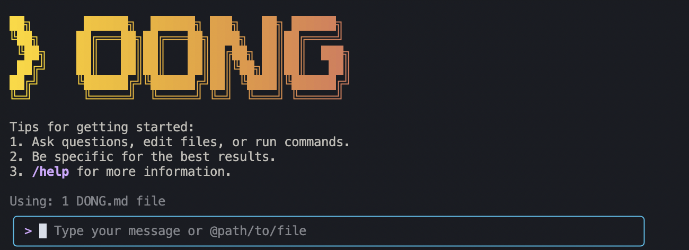

# Dong Code - AI-Powered Professional Book Writing Assistant

<div align="center">




**AI-powered writing assistant for professional book authors**

[Installation](#installation) • [Quick Start](#quick-start) • [Book Writing Workflows](#book-writing-workflows) • [Features](#key-features) • [Documentation](./docs/)

</div>

Dong Code is a specialized AI writing assistant designed to help professional authors create high-quality, well-structured books that meet publishing standards. Whether you're writing educational textbooks, technical manuals, research-based books, or creative non-fiction, Dong Code provides intelligent assistance for every stage of the book creation process.

## 🚀 Installation

### Prerequisites

Ensure you have [Node.js version 20](https://nodejs.org/en/download) or higher installed.

```bash
# Check your Node.js version
node --version
```

### Install from GitHub Repository

```bash
# Clone the repository
git clone https://github.com/madisondong/dong-code.git
cd dong-code

# Install dependencies
npm install

# Install globally
npm install -g .
```

### Alternative: Install from npm (if available)

```bash
npm install -g @madisondong/dong-code@latest
dong --version
```

## 🎯 Professional Book Writing Workflows

Dong Code is specifically designed to help professional authors streamline their writing process. Here are comprehensive examples of how to use it for different aspects of book creation:

### 📚 Book Planning & Research

```bash
# Start Dong Code
dong

# Book planning assistance
> Help me plan a comprehensive outline for my book on [topic]
> Research the current market for books in [genre/field]
> Create a detailed chapter structure with learning objectives
> Identify key themes and concepts to cover in my book
> Analyze competing books in my field and find gaps to fill
```

### ✍️ Content Development & Writing

```bash
# Professional writing assistance
> Write a compelling introduction for my chapter on [topic]
> Help me explain [complex concept] in clear, engaging language
> Create a step-by-step guide for [process/technique]
> Develop case studies and real-world examples for [concept]
> Write clear learning objectives for each chapter
```

### 🔬 Research & Fact-Checking

```bash
# Research and verification
> Find recent studies and papers on [topic] for my literature review
> Verify the accuracy of [claim/statistic] with reliable sources
> Create a comprehensive bibliography for my research
> Identify gaps in current research that my book could address
> Help me integrate current trends and developments into my content
```

### 📊 Technical Content & Code Examples

```bash
# Technical writing and code generation
> Create educational code examples that demonstrate [concept]
> Write clear explanations of [technical process] for [audience level]
> Generate interactive examples and exercises for my technical book
> Design hands-on projects that reinforce key learning objectives
> Create visualizations and diagrams to explain complex concepts
```

### 📝 Editing & Refinement

```bash
# Professional editing support
> Review this chapter for clarity and engagement
> Help me improve the flow and transitions between sections
> Check for consistency in terminology and style throughout
> Identify opportunities to increase reader engagement
> Ensure my content meets professional publishing standards
```

### 📖 Publishing Preparation

```bash
# Publishing and submission support
> Format my manuscript according to [publisher] guidelines
> Create a compelling book proposal and marketing materials
> Help me prepare submission materials for publishers
> Review my content for accessibility and diverse audiences
> Create supplementary materials (glossary, index, appendices)
```

## 🛠️ Quick Start for Authors

```bash
# Start Dong Code
dong

# Example commands for professional authors
> Help me outline my book on [your topic]
> Create a compelling introduction for my first chapter
> Research current trends in [your field] for my book
> Write clear learning objectives for my target audience
> Generate engaging examples that illustrate my key concepts
```

### Session Management

Control your token usage with configurable session limits:

```bash
# Create settings file
mkdir -p ~/.dong
echo '{"sessionTokenLimit": 32000}' > ~/.dong/settings.json
```

**Session Commands:**
- `/compress` - Compress conversation history
- `/clear` - Clear conversation history
- `/status` - Check token usage

## 🔐 Authorization

### Option 1: Qwen OAuth (Recommended)

```bash
# Easy setup with browser authentication
qwen
```

**Benefits:**
- ✅ 2,000 requests/day free
- ✅ Automatic credential management
- ✅ No configuration required

### Option 2: API Key Setup

Create a `.env` file in your project:

```env
OPENAI_API_KEY=your_api_key_here
OPENAI_BASE_URL=https://dashscope.aliyuncs.com/compatible-mode/v1
OPENAI_MODEL=qwen3-coder-plus
```

## 📖 Professional Book Writing Examples

### 1. Book Planning & Market Research

```text
> I'm writing a book on [topic]. Help me:
> - Research the current market and identify my target audience
> - Create a comprehensive outline with clear learning objectives
> - Analyze competing books and find unique positioning opportunities
> - Develop a compelling value proposition for my book
```

### 2. Content Development & Structure

```text
> For my book on [subject], help me:
> - Write clear, engaging chapter introductions
> - Create logical progression from basic to advanced concepts
> - Develop compelling examples and case studies
> - Design interactive elements and exercises for readers
```

### 3. Research & Academic Writing

```text
> Help me with the research for my book:
> - Conduct a comprehensive literature review on [topic]
> - Find current studies and developments in [field]
> - Create proper citations and bibliographic references
> - Verify facts and claims with reliable sources
```

### 4. Technical Content & Educational Materials

```text
> Create educational content for my technical book:
> - Write clear explanations of complex concepts
> - Generate code examples and demonstrations
> - Design hands-on exercises and projects
> - Create assessment materials and learning objectives
```

## 🎨 Advanced Features for Professional Authors

### Content Organization & Planning

```bash
# Professional book structure
> Help me organize my book with proper chapter flow and progression
> Create detailed outlines with learning objectives for each section
> Design a table of contents that guides readers through the material
> Plan the integration of examples, exercises, and supplementary materials
```

### Writing Enhancement & Style

```bash
# Professional writing improvement
> Analyze and improve my writing style for my target audience
> Enhance clarity and readability of complex explanations
> Create engaging transitions between ideas and sections
> Develop a consistent voice and tone throughout the book
```

### Publishing & Market Preparation

```bash
# Publishing readiness
> Format my manuscript according to publisher requirements
> Create compelling book proposals and marketing materials
> Prepare submission packages for different publishing platforms
> Develop author bio, book description, and promotional content
```

## 🔧 Author-Specific Workflows

### Book Proposal Development

```bash
# Professional book proposals
> Help me create a compelling book proposal for [publisher/agent]
> Develop a detailed chapter outline with sample content
> Write an engaging author bio and credentials
> Create market analysis and competitive positioning
```

### Content Quality Assurance

```bash
# Quality control and improvement
> Review my content for accuracy, clarity, and engagement
> Check for consistency in terminology and style
> Identify areas that need additional research or clarification
> Ensure my content meets professional publishing standards
```

### Reader Engagement & Accessibility

```bash
# Audience-focused content
> Design content that engages diverse audiences
> Create accessible explanations for different learning styles
> Develop interactive elements that enhance reader experience
> Ensure content is inclusive and culturally sensitive
```

## 📋 Popular Commands for Professional Authors

### Book Planning
```text
> Create a comprehensive outline for my book on [topic]
> Research the market and identify my target audience
> Develop learning objectives for each chapter
> Plan the progression of concepts from basic to advanced
```

### Content Creation
```text
> Write a compelling introduction for [chapter/topic]
> Create engaging examples that illustrate [concept]
> Develop case studies and real-world applications
> Design interactive exercises for [learning objective]
```

### Research & Verification
```text
> Find current research and studies on [topic]
> Verify the accuracy of [claim/statistic]
> Create a comprehensive bibliography
> Identify gaps in current understanding
```

### Publishing Preparation
```text
> Format my manuscript for [publisher/platform]
> Create a compelling book proposal
> Develop marketing materials and author bio
> Prepare submission materials
```

## 🚀 Getting Started with Your Professional Book

1. **Install Dong Code** using the installation instructions above
2. **Set up authentication** with Qwen OAuth or API keys
3. **Start with planning** - use Dong Code to research your topic and plan your book
4. **Create your outline** - get help organizing your content structure
5. **Develop your content** - use AI assistance for clear, engaging writing
6. **Research and verify** - ensure accuracy and current relevance
7. **Edit and refine** - use Dong Code for professional editing and improvement
8. **Prepare for publishing** - format and submit your work professionally

## Acknowledgments
This project is based on [Google Gemini CLI](https://github.com/google-gemini/gemini-cli) and [Qwen Code](https://github.com/QwenLM/qwen-code). We acknowledge and appreciate the excellent work of the Gemini CLI team and Qwen Code team.

## 📄 License

[LICENSE](./LICENSE)

---

**Happy writing!** Dong Code is here to help you create professional, engaging books that educate, inspire, and succeed in the marketplace.
